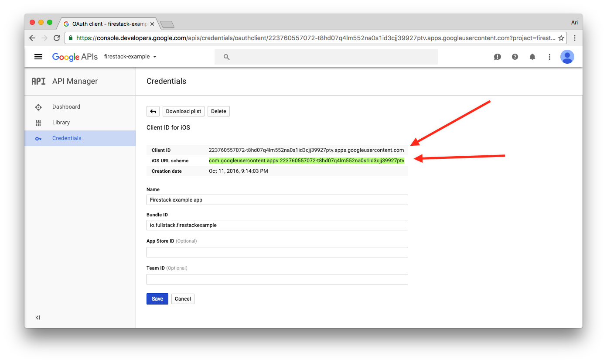

## react-native-oauth

The `react-native-oauth` library provides an interface to OAuth 1.0 and OAuth 2.0 providers with support for the following providers for React Native apps:

* Twitter
* Facebook
* Google
* Github

## TL;DR;

This library cuts out the muck of dealing with the [OAuth 1.0](https://tools.ietf.org/html/rfc5849) and [OAuth 2.0](http://oauth.net/2/) protocols in react-native apps. The API is incredibly simple and straight-forward and is intended on getting you up and running quickly with OAuth providers (such as Facebook, Github, Twitter, etc).

```javascript
const manager = new OAuthManager('firestackexample')
manager.configure({
  twitter: {
    consumer_key: 'SOME_CONSUMER_KEY',
    consumer_secret: 'SOME_CONSUMER_SECRET'
  },
  google: {
    callback_url: `io.fullstack.FirestackExample:/oauth2redirect`,
    client_id: 'YOUR_CLIENT_ID',
    client_secret: 'YOUR_SECRET'
  }
});

// ...
manager.authorize('google', {scopes: 'profile email'})
.then(resp => console.log('Your users ID'))
.catch(err => console.log('There was an error'));
```

## Features

* Isolates the OAuth experience to a few simple methods.
* Atomatically stores the tokens for later retrieval
* Works with many providers and simple to add new providers
* Works on both Android and iOS
* Makes calling API methods a snap
* Integrates seamlessly with Firestack (but can be used without it)

## Installation

Install `react-native-oauth` in the usual manner using `npm`:

```javascript
npm install --save react-native-oauth
```

As we are integrating with react-native, we have a little more setup to integrating with our apps.

### iOS setup

#### RCTLinkingManager

Since `react-native-oauth` depends upon the `RCTLinkingManager` (from react-native core), we'll need to make sure we link this in our app. 

In your app, add the following line to your `HEADER SEARCH PATHS`:

```
$(SRCROOT)/../node_modules/react-native/Libraries/LinkingIOS
```


#### Automatically with [rnpm](https://github.com/rnpm/rnpm)

To automatically link our `react-native-oauth` client to our application, use the `rnpm` tool. [rnpm](https://github.com/rnpm/rnpm) is a React Native package manager which can help to automate the process of linking package environments.

```bash
react-native link react-native-oauth
```

Note: due to some restrictions on iOS, this module requires you to install cocoapods. The process has been semi-automated through using the above `react-native link` command. 

Once you have linked this library, run the following command in the root directory: 

```
(cd ios && pod install)
```

Finally, open the created `.xcworkspace` in the `ios/` directory (**NOT THE `.xproj` file**) when it's complete.

### Android setup

All we need to do is link `react-native-oauth` to our project and Android should just work.

## Handle deep linking loading

**Required step**

We'll need to handle app loading from a url with our app in order to handle authentication from other providers. That is, we'll need to make sure our app knows about the credentials we're authenticating our users against when the app loads _after_ a provider is authenticated against.

### iOS setup

We need to add a callback method in our `ios/AppDelegate.m` file and then call our OAuthManager helper method. Let's load the `ios/AppDelegate.m` file and add the following all the way at the bottom (but before the `@end`):

```objectivec
// Add the import at the top:
#import "OAuthManager.h"
// ...
@implementation AppDelegate
// ...
- (BOOL)application:(UIApplication *)application openURL:(NSURL *)url sourceApplication:(NSString *)sourceApplication annotation:(id)annotation {
  return [OAuthManager handleOpenUrl:application
                             openURL:url
                   sourceApplication:sourceApplication
                          annotation:annotation];
}
```

In addition, we'll need to set up the handlers within the iOS app. Add the following line somewhere in your `application:didFinishLaunchingWithOptions:` method, like so:

```objectivec
- (BOOL)application:(UIApplication *)application didFinishLaunchingWithOptions:(NSDictionary *)launchOptions
{
  NSURL *jsCodeLocation;

  jsCodeLocation = [[RCTBundleURLProvider sharedSettings] jsBundleURLForBundleRoot:@"index.ios" fallbackResource:nil];
  
  // other existing setup here
  
  // ADD THIS LINE SOMEWHERE IN THIS FUNCTION
  [OAuthManager setupOAuthHandler:application];
  // ...
  
  [self.window makeKeyAndVisible];
  return YES;
}
```

When our app loads up with a request that is coming back from OAuthManager _and_ matches the url pattern, OAuthManager will take over and handle the rest and storing the credentials for later use.

### Android setup

After we link `react-native-oauth` to our application, we're ready to go. Android integration is much simpler, thanks to the in-app browser ability for our apps. `react-native-oauth` handles this for you.

One note, *all* of the callback urls follow the scheme: `http://localhost/[provider_name]`. Make sure this is set as a configuration for each provider below (documented in the provider setup sections).

### Adding URL schemes

In order for our app to load through these callbacks, we need to tell our iOS app that we want to load them. In order to do that, we'll have to create some URL schemes to register our app. Some providers require specific schemes (mentioned later). 

These URL schemes can be added by navigating to to the `info` panel of our app in Xcode (see screenshot).


Let's add the appropriate one for our provider. For instance, to set up twitter, add the app name as a URL scheme in the URL scheme box. 


## Creating the manager

In our JS, we can create the manager by instantiating a new instance of it using the `new` method and passing it the name of our app:

```javascript
const manager = new OAuthManager('firestackexample')
```

We need to pass the name of our app as the oauth manager uses this to create callback keys. This _must_ match the URL route created in your iOS app. For instance, above we created a URL scheme for Twitter. Pass this as the string in the `OAuthManager` constructor.

## Configuring our providers

Providers, such as Facebook require some custom setup for each one. The following providers have been implemented and we're working on making more (and making it easier to add more, although the code is not impressively complex either, so it should be relatively simple to add more providers).

In order to configure providers, the `react-native-oauth` library exports the `configureProvider()` method, which accepts _two_ parameters and returns a promise:

1. The provider name, such as `twitter` and `facebook`
2. The provider's individual credentials

For instance, this might look like:

```javascript
const config =  {
  twitter: {
    consumer_key: 'SOME_CONSUMER_KEY',
    consumer_secret: 'SOME_CONSUMER_SECRET'
  },
  facebook: {
    client_id: 'YOUR_CLIENT_ID',
    client_Secret: 'YOUR_CLIENT_SECRET'
  }
}
// Create the manager
const manager = new OAuthManager('firestackexample')
// configure the manager
manager.configure(config);
```

The `consumer_key` and `consumer_secret` values are _generally_ provided by the provider development program. In the case of [twitter](https://apps.twitter.com), we can create an app and generate these values through their [development dashboard](https://apps.twitter.com).

### Implemented providers

The following list are the providers we've implemented thus far in `react-native-oauth` and the _required_ keys to pass when configuring the provider:

#### Twitter (iOS/Android)

To authenticate against twitter, we need to register a Twitter application. Register your twitter application (or create a new one at [apps.twitter.com](https://apps.twitter.com)). 


Once you have created one, navigate to the application and find the `Keys and Access Tokens`. Take note of the consumer key and secret:


Twitter's URL scheme needs to be the app name (that we pass into the constructor method). Make sure we have one registered in Xcode as the same name:


Add these values to the authorization configuration to pass to the `configure()` method as:

```javascript
const config =  {
  twitter: {
    consumer_key: 'SOME_CONSUMER_KEY',
    consumer_secret: 'SOME_CONSUMER_SECRET'
  }
}
```

#### Facebook (iOS/Android)

To add facebook authentication, we'll need to have a Facebook app. To create one (or use an existing one), navigate to [developers.facebook.com/](https://developers.facebook.com/). 


Find or create an application and find the app id. Take note of this app id. Next, navigate to the `Settings` panel and find your client_secret.


Before we leave the Facebook settings, we need to tell Facebook we have a new redirect url to register. Navigate to the bottom of the page and add the following into the `bundle ID` field:

`fb{YOUR_APP_ID}`

For instance, my app ID in this example is: `1745641015707619`. In the `Bundle ID` field, I have added `fb1745641015707619`. 


We'll need to create a new URL scheme for Facebook and (this is a weird bug on the Facebook side) the facebook redirect URL scheme _must be the first one_ in the list. The URL scheme needs to be the same id as the `Bundle ID` copied from above:


Back in our application, add the App ID and the secret as:

```javascript
const config =  {
  facebook: {
    client_id: 'YOUR_APP_ID',
    client_secret: 'YOUR_APP_SECRET'
  }
}
```

#### Google  (iOS/Android)

To add Google auth to our application, first we'll need to create a google application. Create or use an existing one by heading to the [developers.google.com/](https://developers.google.com/) page (or the console directly at [https://console.developers.google.com](https://console.developers.google.com)). 


We need to enable the `Identity Toolkit API` API. Click on `Enable API` and add this api to your app. Once it's enabled, we'll need to collect our credentials.

Navigate to the `Credentials` tab and create a new credential. Create a **web API credential**. Take note of the client id and the URL scheme. In addition, make sure to set the bundle ID as the bundle id in our application in Xcode:



Take note of the `iOS URL Scheme`. We'll need to add this as a URL scheme in our app. In the `Info` panel of our app target (in Xcode), add the URL scheme:


Finally, add the `client_id` credential as the id from the url page as well as the ios scheme (with any path) in our app configuration:

```javascript
const config =  {
  google: {
    callback_url: `[IOS SCHEME]:/google`,
    client_id: 'YOUR_CLIENT_ID',
    client_secret: 'YOUR_CLIENT_SECRET'
  }
}
```

#### Github  (iOS/Android)

Adding Github auth to our application is pretty simple as well. We'll need to create a web application on the github apps page, which can be found at [https://github.com/settings/developers](https://github.com/settings/developers). Create one, making sure to add _two_ apps (one for iOS and one for Android) with the callback urls as:

* ios: [app_name]:// oauth (for example: `firestackexample://oauth`)
* android: http://localhost/github

Take note of the `client_id` and `client_secret`


The `iOS URL Scheme` is the same as the twitter version, which means we'll just add the app name as a URL scheme (i.e. `firestackexample`).

Add the `client_id` and `client_secret` credentials to your configuration object:

```javascript
const config =  {
  github: {
    client_id: 'YOUR_CLIENT_ID',
    client_secret: 'YOUR_CLIENT_SECRET'
  }
}
```

## Authenticating against our providers

We can use the manager in our app using the `authorize()` method on the manager.

The `authorize` method takes two arguments (the first one is required):

* The provider we wish to authenticate against (i.e. twitter, facebook)
* The list of options on a per-provider basis (optional)

For example:

```javascript
manager.authorize('twitter')
  .then(resp => console.log(resp))
  .catch(err => console.log(err));
```

This method returns a promise that is resolved once the authentication has been completed. You'll get access to the authentication keys in the `resp` object.

The `resp` object is set as follows:

```javascript
{
  status: "ok",
  response: {
    authorized: true, (boolean)
    uuid: "UUID", (user UUID)
    credentials: {
      access_token: "access token", 
      refresh_token: "refresh token",
      type: 1
    }
  }
}
```

## Calling a provider's API

We can use OAuthManager to make requests to endpoints from our providers as well. For instance, let's say we want to get a user's time line from twitter. We would make the request to the url [https://api.twitter.com/1.1/statuses/user_timeline.json](https://api.twitter.com/1.1/statuses/user_timeline.json)

If our user has been authorized for thi request, we can execute the request using the credentials stored by the OAuthManager. 

The `makeRequest()` method accepts 3 parameters:

1. The provider we're making a request to
2. The url (or path) we want to make the request
3. Any additional options

We can pass a list of options for our request with the last argument. The keys OAuthManager recognizes are:

1. `params` - The query parameters
2. `method` - The http method to make the request with. 

Available HTTP methods:
  * get
  * post
  * put
  * delete
  * head
  * options
  * trace


```javascript
const userTimelineUrl = 'https://api.twitter.com/1.1/statuses/user_timeline.json';
authManager
  .makeRequest('twitter', userTimelineUrl)
  .then(resp => {
    console.log('Data ->', resp.data);
  });
```

It's possible to use just the path as well. For instance, making a request with Facebook at the `/me` endpoint can be:

```javascript
authManager
  .makeRequest('facebook', '/me')
  .then(resp => {
    console.log('Data ->', resp.data);
  });
```

To add more data to our requests, we can pass a third argument:

```javascript
authManager
  .makeRequest('facebook', '/me', { 
    headers: { 'Content-Type': 'application/java' }, 
    params: { email: 'me+rocks@ari.io' }
  })
  .then(resp => {
    console.log('Data ->', resp.data);
  });
```

## Getting authorized accounts

Since OAuthManager handles storing user accounts, we can query it to see which accounts have already been authorized or not using `savedAccounts()`:

```javascript
manager.savedAccounts()
  .then(resp => {
    console.log('account list: ', resp.accounts);
  })
```

## deauthorize()

We can `deauthorize()` our user's from using the provider by calling the `deauthorize()` method. It accepts a single parameter:

1. The `provider` we want to remove from our user credentials.

```javascript
authManager.deauthorize('twitter');
```

## Contributing

This is _open-source_ software and we can make it rock for everyone through contributions.

```shell
git clone https://github.com/fullstackreact/react-native-oauth.git
cd react-native-oauth
npm install
```
___

## TODOS:

* [x] Simplify method of adding providers
* [x] Add github(https://developer.github.com/v3/oauth/) support
* [x] Add Google support
* [x] Add Facebook support
* [x] Add Android support
